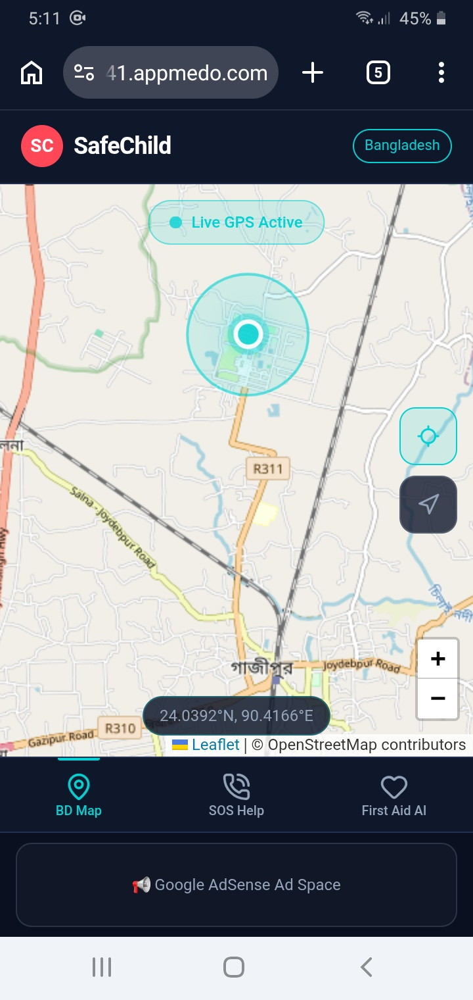
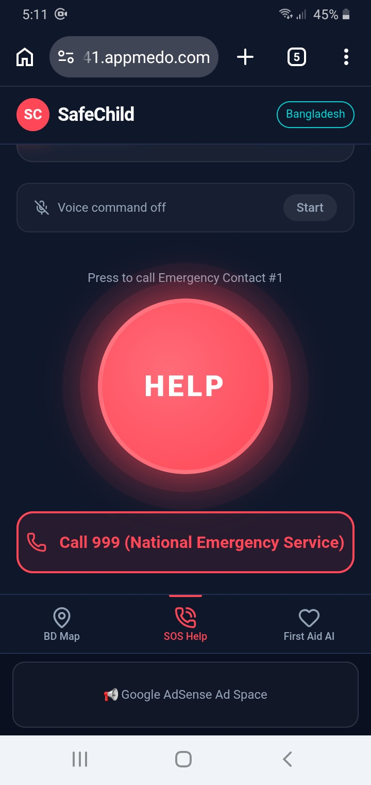

# 🛡️ SafeChild

**SafeChild** is a premium, mobile-responsive web application explicitly designed to enhance children's safety and emergency response efficiency in Bangladesh[span_0](start_span)[span_0](end_span). Built with a modern **Neon-Soft Minimalist UI**, the platform features dark theme consistency, continuous background processes for threat tracking, and smart serverless AI execution[span_1](start_span)[span_1](end_span).

---

## 📸 App Previews

  
  
  

---

## ✨ Key Features

### 📍 1. Live Bangladesh GPS Map
* **Interactive Mapping:** Powered by Leaflet.js and OpenStreetMap layers centered seamlessly on Bangladesh[span_2](start_span)[span_2](end_span).
* **Real-time Geolocation:** Integrates native HTML5 Geolocation APIs to pull live latitude and longitude streams[span_3](start_span)[span_3](end_span).
* **Visual Identifiers:** Renders a unique pulsing, glowing **Electric Cyan live marker** tracking user displacement[span_4](start_span)[span_4](end_span).

### 🚨 2. Intelligent SOS Help System
* **Voice-Activated Triggers:** Features hands-free continuous processing listening specifically for the phrase `"Help Help"` using the Web Speech token mechanism[span_5](start_span)[span_5](end_span).
* **Alternating Call Routing Logic:** Cycling execution infrastructure that forwards emergency operations dynamically (First trigger targets Contact 1; subsequent continuous trigger routes to Contact 2)[span_6](start_span)[span_6](end_span).
* **National Redirection:** Persistent high-contrast Neon Red backup panel targeting the direct **999 National Emergency Routing Hub**[span_7](start_span)[span_7](end_span).
* **Local Persistence:** Contact configuration updates are saved locally via browser `localStorage` ensuring configuration continuity across sessions[span_8](start_span)[span_8](end_span).

### 🤖 3. First Aid Conversational AI
* **Dual-Language Core:** Seamless semantic understanding across both **English** and **Bangla (বাংলা)** inputs[span_9](start_span)[span_9](end_span).
* **Medical Context Engine:** Driven by the **Gemini 2.5 Flash** large language model, delivering structured, highly empathetic step-by-step immediate treatment steps[span_10](start_span)[span_10](end_span).
* **Embedded Guardrail UI:** Permanent high-visibility yellow-bordered disclaimer highlighting clear operational limits—declaring it strictly a temporary support mechanism that does not replace real doctor prescriptions[span_11](start_span)[span_11](end_span).

---

## 🏗️ Technical Architecture & AI Workflow

* **Data Entry (Inputs):** Free-form medical query strings (English/Bangla), browser-derived physical GPS coordinates, and real-time mic streaming tokens[span_12](start_span)[span_12](end_span).
* **Core Processing Engine:** Edge-routed function logic built securely around the **Gemini 2.5 Flash API** infrastructure[span_13](start_span)[span_13](end_span). Secure gateway headers handle private operational keys (`X-Gateway-Authorization`) safely to mitigate malicious public intercepts[span_14](start_span)[span_14](end_span).
* **Outputs Received:** Dynamic UI rendering of tracked movement matrices, immediate dial triggers, and empathetic, markdown-compliant step-by-step clinical first aid walkthrough responses[span_15](start_span)[span_15](end_span).

---

## 🎨 UI Theme Metrics

* **Background Matrix:** Dark Midnight Blue (`#0F172A`)[span_16](start_span)[span_16](end_span)
* **Action & Emergency Components:** Neon Red / Coral (`#FF4757`)[span_17](start_span)[span_17](end_span)
* **Geospatial & Cognitive AI Nodes:** Electric Cyan (`#00D2D3`)[span_18](start_span)[span_18](end_span)

## 🔗 Live Demo

Deploy লিংকটি দেখতে এবং অ্যাপটি সরাসরি ব্যবহার করতে নিচের বাটনে ক্লিক করুন:

---
