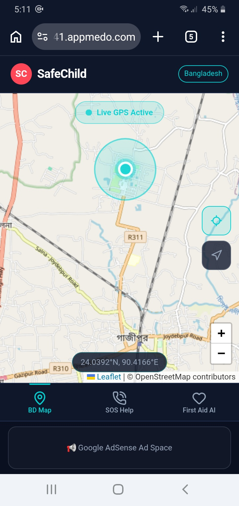
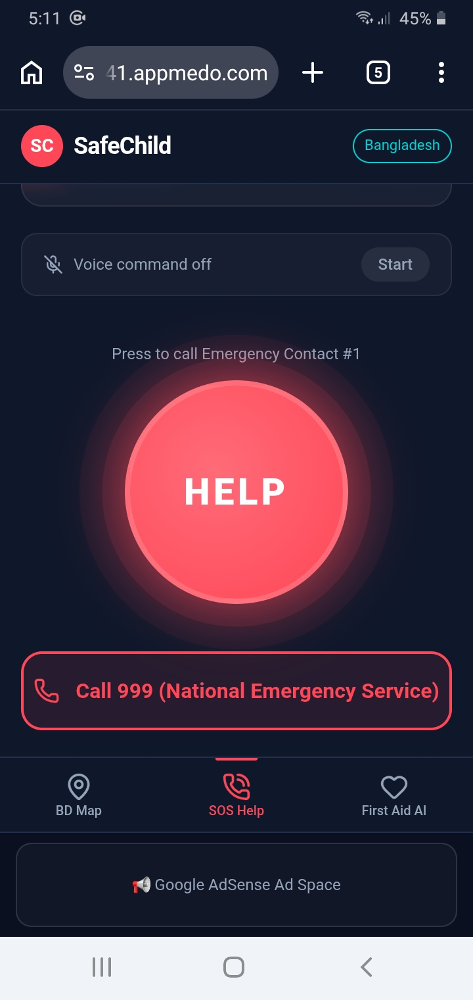
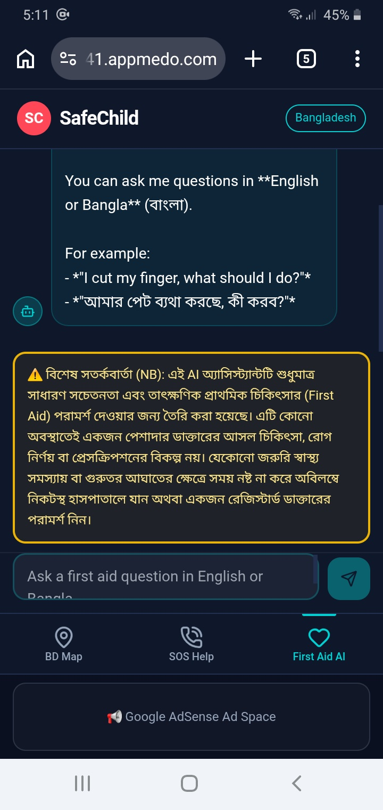

# 🛡️ SafeChild

**SafeChild** is a mobile-responsive web app built to improve children's personal safety and
emergency response in Bangladesh. It combines live location tracking, hands-free voice-activated
SOS calling, and an AI first-aid assistant — wrapped in a dark, neon-accented UI.

---

## 🔗 Live Demo

[](https://app-cdk7t9oatj41.appmedo.com/)

---

## 📸 App Previews

<p align="center">
  
  
  
</p>

---

## ✨ Key Features

### 📍 1. Live GPS Map
- Interactive map powered by **Leaflet.js** + OpenStreetMap tiles, centered on the user's location.
- Real-time position via the browser's native **HTML5 Geolocation API**, with an accuracy radius
  drawn around the live marker.

### 🚨 2. Voice-Activated SOS
- Hands-free listening via the **Web Speech Recognition API** — saying **"help"** anywhere in
  speech triggers an emergency call.
- A 5-second cooldown prevents the same phrase from firing multiple calls back-to-back.
- Call routing: dials the **primary contact** if one is saved, falls back to the **secondary
  contact**, and if neither is set, calls the **999 national emergency line** directly.
- Contact numbers are saved locally in the browser (`localStorage`), so they persist between visits.
- A permanent, always-visible **999 button** is also available for manual one-tap emergency calling.

### 🤖 3. First Aid AI Chat
- Bilingual (English + বাংলা) conversational assistant for basic first-aid guidance, powered by
  **Gemini 2.5 Flash**.
- Keyword-based escalation: if the message or AI reply mentions signs of a serious emergency
  (unconscious, not breathing, severe bleeding, poisoning, etc.), the app flags it and recommends
  calling 999 or a guardian immediately.
- A persistent disclaimer makes clear this is first-aid guidance only, not a medical diagnosis or
  a replacement for a doctor.

---

## 🏗️ Tech Stack

| Layer | Technology |
| :--- | :--- |
| Frontend | React 18 + TypeScript, built with Vite |
| Mapping | Leaflet / react-leaflet |
| AI | Gemini 2.5 Flash via the Gemini API |
| Backend | Vercel Serverless Function (`api/gemini-chat.ts`) |
| Styling | Custom CSS — dark theme, neon-accent UI |

**Security note:** the Gemini API key is only ever read on the server side, inside the serverless
function. It is never sent to or exposed in the browser — the frontend just calls its own
`/api/gemini-chat` endpoint.

---

## 🚀 Getting Started

### Prerequisites
- Node.js ≥ 18
- A free Gemini API key from [Google AI Studio](https://aistudio.google.com/app/apikey)

### Local setup
```bash
# 1. Clone the repo
git clone https://github.com/<your-username>/SafeChild.git
cd SafeChild

# 2. Install dependencies
npm install

# 3. Set up environment variables
cp .env.example .env
# then open .env and paste your GEMINI_API_KEY

# 4. Run the app
npm run dev        # frontend only (Vite), on http://localhost:5173
# or, to also run the /api routes locally:
vercel dev          # requires the Vercel CLI (npm i -g vercel)
```

### Build for production
```bash
npm run build
```

### Deploy
The project is set up to deploy on **Vercel** — connect the GitHub repo, add `GEMINI_API_KEY` as
an environment variable in the Vercel project settings, and deploy.

---

## 🎨 UI Theme

| Element | Color |
| :--- | :--- |
| Background | Dark Midnight Blue `#0F172A` |
| Emergency / SOS actions | Neon Red / Coral `#FF4757` |
| Map & AI accents | Electric Cyan `#00D2D3` |

---

## ⚠️ Disclaimer

SafeChild's AI assistant provides general first-aid information only. It is **not** a substitute
for professional medical advice, diagnosis, or treatment. In any serious emergency, always call
**999** or your nearest hospital immediately.

---

## 📄 License

This project was built for the **Bangladesh ICT & Innovation Awards 2026**.
